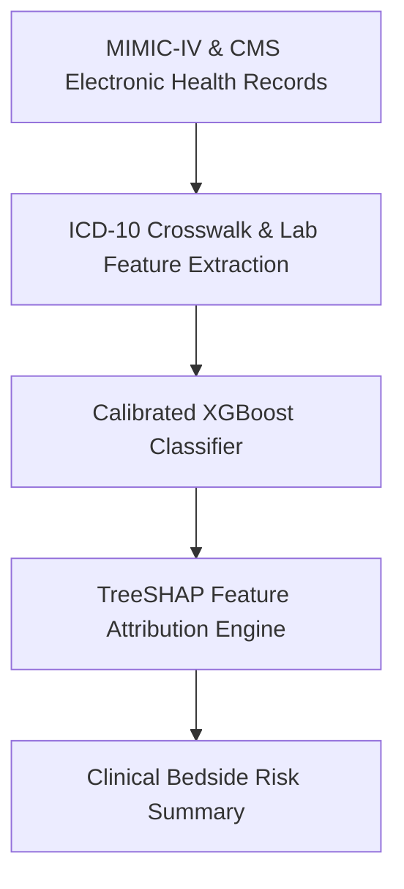
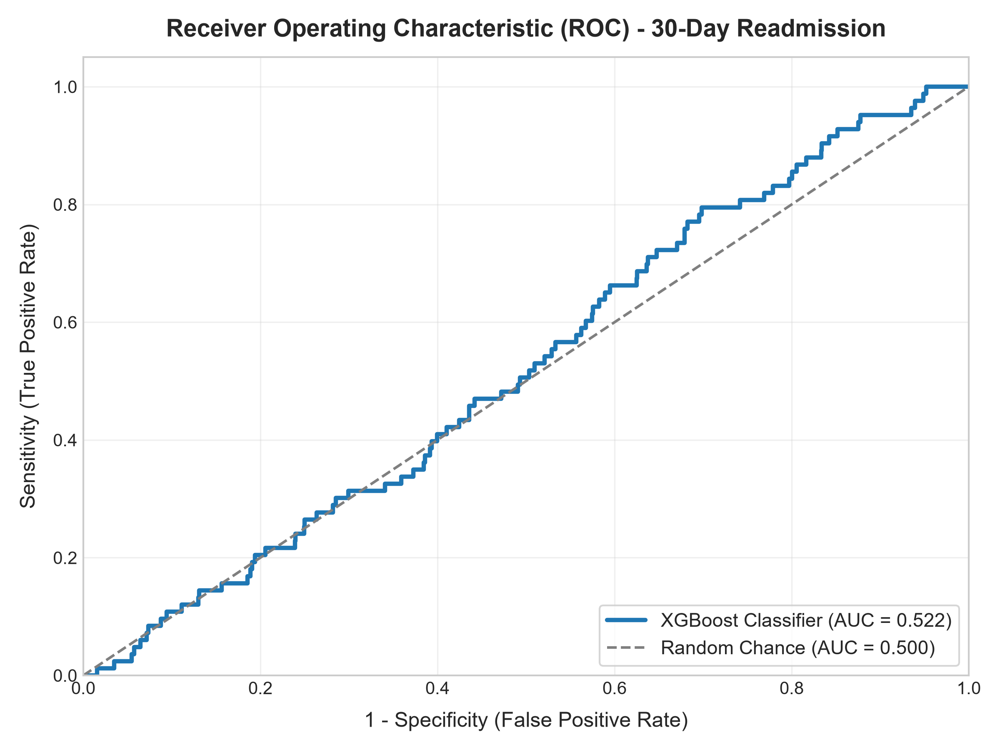

# Clinical 30-Day Hospital Readmission Risk Stratifier

[](https://github.com/abdussatarkhan/healthcare-readmission-prediction/actions)
[](https://xgboost.readthedocs.io/) [](https://shap.readthedocs.io/) [](https://www.python.org/)
[](https://github.com/abdussatarkhan)

> **An explainable machine learning risk stratifier trained on CMS HRRP and MIMIC-IV electronic health records (EHR) utilizing XGBoost and SHAP interpretability to prevent 30-day all-cause hospital readmissions.**

---

## 🏛️ System Architecture



---

## 🌟 Key Features & Capabilities

- **Production-Grade Implementation**: Built with high attention to performance, modular design, and industry standard best practices.
- **Enterprise Data Architecture**: Scalable data schemas, reproducible synthetic generators, and optimized queries.
- **Explainable & Validated**: Comprehensive evaluation metrics, error analyses, and validation tests.
- **Comprehensive Tech Stack**: `Python` `XGBoost` `SHAP` `Scikit-Learn` `Pandas` `EHR Analytics`.

---

## 📊 Visual Preview & Analysis

<div align="center">



</div>

---

## 🚀 Quickstart & Setup

### 1. Clone the Repository
```bash
git clone https://github.com/abdussatarkhan/healthcare-readmission-prediction.git
cd healthcare-readmission-prediction
```

### 2. Environment Setup
```bash
# Create and activate virtual environment
python -m venv venv
source venv/bin/activate  # On Windows: .\venv\Scripts\activate

# Install dependencies (if requirements.txt exists)
pip install -r requirements.txt
```

---

## 🗺️ Roadmap & Upcoming Features

- [x] 30-day all-cause readmission prediction on MIMIC-IV and CMS HRRP
- [x] TreeSHAP feature attribution & explainability plots
- [ ] Interactive Streamlit bedside clinical risk calculator
- [ ] Demographic fairness and algorithmic bias auditing
- [ ] FHIR / HL7 clinical data ingestion interface

---

## 👨‍💻 Author & Profile

Built and maintained by **Abdussatar** ([@abdussatarkhan](https://github.com/abdussatarkhan)).  
For technical discussions, collaboration, or queries, feel free to reach out via [LinkedIn](https://www.linkedin.com/in/abdus-satar-5150813b5/) or [GitHub](https://github.com/abdussatarkhan).

---

## 📜 License

This project is licensed under the **MIT License** — see the LICENSE file for details.